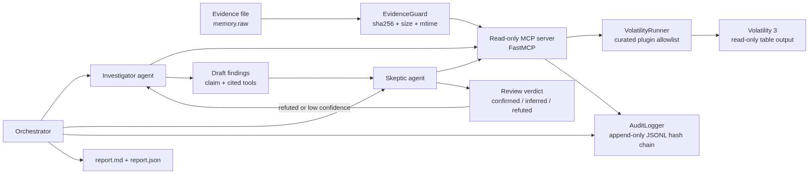
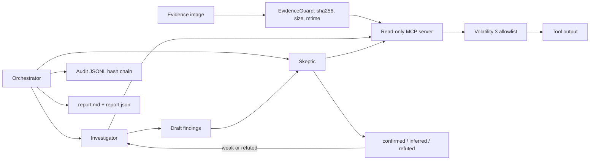

# Protocol SIFT++

> **60-second version (for reviewers).** An autonomous Windows-memory DFIR agent
> that is *forensically defensible*:
> 1. **It cannot alter evidence** — destructive actions don't exist in its tool
>    server (`siftpp-spoliation-test`: 14/14 attacks refused, evidence hash unchanged).
> 2. **It catches its own hallucinations** — a Skeptic agent independently reruns
>    tools to refute each finding (`confirmed`/`inferred`/`refuted`) and sends weak
>    ones back for re-investigation. (An independent re-run even **refuted its own
>    "DKOM rootkit" confirmation**, correctly flagging it as a Volatility symbol
>    artifact — `docs/examples/srl-2018-linux/`.)
> 3. **It keeps a tamper-evident chain of custody** — a hash-chained audit log where
>    editing any one record is detected (`siftpp-tamper-test`).
>
> Windows run on a SANS APT memory image: **4 confirmed of 10 findings, 2
> self-corrections, evidence integrity verified, 302-record audit (hash chain OK)**.
> Independent Linux reproduction refuted one of those confirmed findings
> (`DKOM/rootkit`) as a tool artifact, leaving **3 retained confirmed findings,
> precision 1.00, recall 0.75, F1 0.86** under the manual-review proxy.
> See the [architecture diagram](docs/architecture.png) and the
> [real report + logs](docs/examples/). See it with **no API key**:
> `uv run siftpp-demo` · attack it: `uv run siftpp-spoliation-test`.

A self-verifying, autonomous DFIR analyst for
[SANS FIND EVIL! 2026](https://findevil.devpost.com/), built around read-only
forensic tools, adversarial verification, and tamper-evident audit logs.

Protocol SIFT++ builds on the Protocol SIFT idea and adds the missing accuracy
loop: an Investigator proposes findings, a Skeptic independently tries to
refute them, and weak findings are sent back for automatic reinvestigation.

What makes it different from a typical "AI finds evil" agent: **every safety claim
is provable by attacking it.** The agent is architecturally incapable of altering
evidence (14/14 destructive attempts refused, evidence SHA-256 unchanged), its
audit log is tamper-evident (edit one record and `verify_chain` fails), and every
finding cites the exact tool command plus its output hash. Forensic defensibility,
not a prompt that says "be careful."

## Judging scorecard — verify each claim in seconds

| FIND EVIL! criterion | What Protocol SIFT++ does | Verify it yourself |
|---|---|---|
| **Autonomous + real-time self-correction** *(tiebreaker)* | Investigator/Skeptic loop, no human in the loop; one run forced 2 corrections, and an independent re-run **refuted its own confirmed "DKOM rootkit"** as a tool artifact | `uv run siftpp-demo` (no key); `docs/examples/srl-2018-linux/report.md` → *Refuted* |
| **IR accuracy / catches its own hallucinations** | Skeptic re-runs tools to refute each finding -> `confirmed`/`inferred`/`refuted`; cross-run correction removed DKOM FP; manual-review proxy: precision 1.00, recall 0.75, F1 0.86 | `docs/ACCURACY_REPORT.md` |
| **Depth > breadth** | One APT memory case, every claim verified, **reproduced on Windows *and* Linux** with byte-identical evidence | `docs/examples/srl-2018-base-file-memory/` + `…/srl-2018-linux/` |
| **Architectural (not prompt) guardrails** | Read-only MCP server: no shell, no dump/write/network tool *exists* — spoliation is impossible by construction | `uv run siftpp-spoliation-test` → 14/14 refused, evidence unchanged |
| **Audit trail to specific tool executions** | Hash-**chained** append-only log (tamper-evident) + every finding cites command + output SHA-256 | `uv run siftpp-tamper-test` → edit detected; `verify_chain(...)` → `(True, 302)` |
| **Usability / docs** | One command, no API key, runs on Windows + Linux/SIFT; full docs | `uv run siftpp-demo` |

> **What most autonomous-IR agents lack — and SIFT++ has:** an **adversarial Skeptic**
> that challenges every finding, a **cryptographic chain of custody** (hash-chained
> audit + per-finding evidence hashes), and safety that's **provable by attacking it**.
> A broad agent that can't verify itself just produces more unverified claims, faster.

### Deliberate scope (why "narrow" is the point)
- **Depth over breadth (criterion #3).** One case, fully verified and reproduced — not many cases, lightly checked. The loop is tool-, model-, and OS-agnostic (Volatility 3 today; Windows + Linux/SIFT; DeepSeek *or* Anthropic), so breadth is configuration, not a redesign.
- **Terminal- and artifact-native, not a dashboard.** Output is structured (`report.json`) and tamper-evident (`audit.jsonl`) so it feeds downstream tooling and stays court-defensible — the forensic idiom, not a demo UI.
- **Honest accuracy.** No public answer key exists for this SANS sample, so instead of a self-graded score we use adversarial verification, cross-run reproduction, and disclosed misses.

## Final Case Run

Selected SANS sample:

```text
SRL-2018 Compromised Enterprise Network / base-file-memory.7z
```

Final DeepSeek run on the extracted memory image:

```text
4 confirmed of 10 findings; 2 self-correction iteration(s); evidence integrity verified.
audit log: 302 records, hash chain OK
```

Cross-platform correction: an independent Linux re-run refuted the Windows
`DKOM/rootkit` confirmation as a Volatility symbol/KDBG artifact. The corrected
confirmed set used for the accuracy table is therefore 3 true positives, 0 false
positives, and 1 false negative: precision 1.00, recall 0.75, F1 0.86.

The key corrected finding involved `ngentask.exe`: the Investigator initially
overstated the malware attribution, the Skeptic downgraded it twice, and the
system converged on a narrower confirmed behavioral claim tied to `psscan` and
`netscan` evidence.

## Why It Matters

AI-assisted attackers can move quickly, but autonomous responders can also
hallucinate. Protocol SIFT++ targets both of FIND EVIL!'s top scoring areas:

- Autonomous execution with real-time self-correction.
- IR accuracy and hallucination catching.

The project is intentionally narrow: one Windows memory case, a curated
Volatility 3 toolset, strong evidence citations, and a visible correction loop.

## Architecture





The agents never receive a generic shell. The MCP server exposes only curated
read-only Volatility tools and checks evidence integrity around every tool call.

## Quick Start

Install dependencies with `uv`, then run the deterministic local demo:

```powershell
C:\Users\Administrator\.local\bin\uv.exe run siftpp-demo
```

Prove the forensic guardrails by attacking them (no key needed):

```powershell
C:\Users\Administrator\.local\bin\uv.exe run siftpp-spoliation-test
C:\Users\Administrator\.local\bin\uv.exe run siftpp-tamper-test
```

Download the selected SANS case:

```powershell
C:\Users\Administrator\.local\bin\uv.exe run siftpp-download-case
```

Run the real investigation with DeepSeek:

```powershell
C:\Users\Administrator\.local\bin\uv.exe run siftpp-investigate `
  --provider deepseek `
  --evidence evidence\srl-2018-base-file-memory\extracted\base-file-memory.img `
  --out analysis\srl-2018-base-file-memory `
  --case-id srl-2018-base-file-memory `
  --offline `
  --max-iterations 3
```

Set `DEEPSEEK_API_KEY` in the environment or an ignored local `.env` file. Do
not commit API keys.

## Outputs

The real run writes:

- `analysis/srl-2018-base-file-memory/report.md`
- `analysis/srl-2018-base-file-memory/report.json`
- `analysis/srl-2018-base-file-memory/audit.jsonl`
- `analysis/srl-2018-base-file-memory/mcp-server.jsonl`

Verify the audit chain:

```powershell
C:\Users\Administrator\.local\bin\uv.exe run python -c `
  "from protocol_siftpp.audit import verify_chain; print(verify_chain('analysis/srl-2018-base-file-memory/audit.jsonl'))"
```

Expected:

```text
(True, 302)
```

## Deliverables

- [Try-it-out instructions](docs/TRY_IT_OUT.md)
- [Architecture and security boundary](docs/ARCHITECTURE.md)
- [Dataset documentation](docs/DATASET.md)
- [Accuracy and integrity report](docs/ACCURACY_REPORT.md)
- [5-minute demo script](docs/DEMO_SCRIPT.md)
- [Agent execution log summary](docs/RUN_LOGS.md)
- [Devpost story draft](docs/DEVPOST_STORY.md)
- [Submission checklist](docs/SUBMISSION_CHECKLIST.md)

## Development Checks

```powershell
C:\Users\Administrator\.local\bin\uv.exe run pytest
C:\Users\Administrator\.local\bin\uv.exe run ruff check .
```

## License

[MIT](LICENSE).
