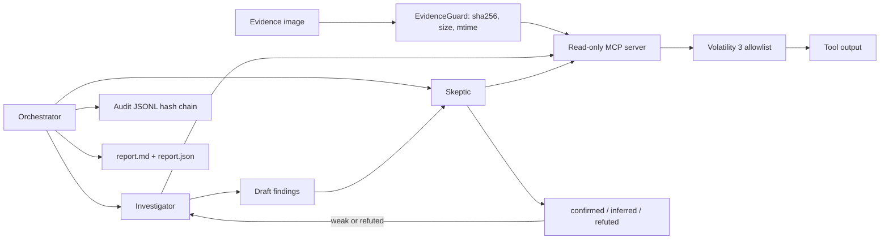

# Protocol SIFT++

A self-verifying, autonomous DFIR analyst for
[SANS FIND EVIL! 2026](https://findevil.devpost.com/), built around read-only
forensic tools, adversarial verification, and tamper-evident audit logs.

Protocol SIFT++ builds on the Protocol SIFT idea and adds the missing accuracy
loop: an Investigator proposes findings, a Skeptic independently tries to
refute them, and weak findings are sent back for automatic reinvestigation.

## Final Case Run

Selected SANS sample:

```text
SRL-2018 Compromised Enterprise Network / base-file-memory.7z
```

Final DeepSeek run on the extracted memory image:

```text
4 confirmed of 10 findings; 2 self-correction iteration(s); evidence integrity verified.
audit log: 302 records, hash chain OK
```

The key corrected finding involved `ngentask.exe`: the Investigator initially
overstated the malware attribution, the Skeptic downgraded it twice, and the
system converged on a narrower confirmed behavioral claim tied to `psscan` and
`netscan` evidence.

## Why It Matters

AI-assisted attackers can move quickly, but autonomous responders can also
hallucinate. Protocol SIFT++ targets both of FIND EVIL!'s top scoring areas:

- Autonomous execution with real-time self-correction.
- IR accuracy and hallucination catching.

The project is intentionally narrow: one Windows memory case, a curated
Volatility 3 toolset, strong evidence citations, and a visible correction loop.

## Architecture



The agents never receive a generic shell. The MCP server exposes only curated
read-only Volatility tools and checks evidence integrity around every tool call.

## Quick Start

Install dependencies with `uv`, then run the deterministic local demo:

```powershell
C:\Users\Administrator\.local\bin\uv.exe run siftpp-demo
```

Download the selected SANS case:

```powershell
C:\Users\Administrator\.local\bin\uv.exe run siftpp-download-case
```

Run the real investigation with DeepSeek:

```powershell
C:\Users\Administrator\.local\bin\uv.exe run siftpp-investigate `
  --provider deepseek `
  --evidence evidence\srl-2018-base-file-memory\extracted\base-file-memory.img `
  --out analysis\srl-2018-base-file-memory `
  --case-id srl-2018-base-file-memory `
  --offline `
  --max-iterations 3
```

Set `DEEPSEEK_API_KEY` in the environment or an ignored local `.env` file. Do
not commit API keys.

## Outputs

The real run writes:

- `analysis/srl-2018-base-file-memory/report.md`
- `analysis/srl-2018-base-file-memory/report.json`
- `analysis/srl-2018-base-file-memory/audit.jsonl`
- `analysis/srl-2018-base-file-memory/mcp-server.jsonl`

Verify the audit chain:

```powershell
C:\Users\Administrator\.local\bin\uv.exe run python -c `
  "from protocol_siftpp.audit import verify_chain; print(verify_chain('analysis/srl-2018-base-file-memory/audit.jsonl'))"
```

Expected:

```text
(True, 302)
```

## Deliverables

- [Try-it-out instructions](docs/TRY_IT_OUT.md)
- [Architecture and security boundary](docs/ARCHITECTURE.md)
- [Dataset documentation](docs/DATASET.md)
- [Accuracy and integrity report](docs/ACCURACY_REPORT.md)
- [5-minute demo script](docs/DEMO_SCRIPT.md)
- [Agent execution log summary](docs/RUN_LOGS.md)
- [Devpost story draft](docs/DEVPOST_STORY.md)
- [Submission checklist](docs/SUBMISSION_CHECKLIST.md)

## Development Checks

```powershell
C:\Users\Administrator\.local\bin\uv.exe run pytest
C:\Users\Administrator\.local\bin\uv.exe run ruff check .
```

## License

[MIT](LICENSE).
