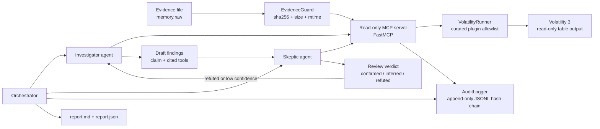

# Architecture

Protocol SIFT++ is an autonomous DFIR loop with an adversarial verifier and a
read-only forensic tool boundary.

## Security Boundary

The architectural guardrail is the MCP server. The agents never receive a
generic shell or arbitrary command runner.

- Only tool names in `READ_ONLY_PLUGINS` can execute.
- The runner builds argv as a list and never invokes a shell.
- Dumping or write-oriented plugins are absent from the registry.
- No output directory flag is passed to Volatility.
- The evidence file is checked before and after every tool call.
- The final integrity check re-hashes the full evidence file.

## Evidence Citations

Each finding cites the exact tool run that supports it:

- MCP tool name.
- Exact argv.
- Output excerpt for human review.
- SHA-256 of the full tool output.
- Evidence SHA-256.

The report is human-readable, while `report.json` preserves the structured
schema for scoring, comparison, and later automation.

## Self-Correction Loop

1. The Investigator runs tools and submits draft findings.
2. The Skeptic independently re-runs relevant tools and tries to refute each
   finding.
3. A finding becomes `confirmed`, `inferred`, or `refuted`.
4. Refuted or low-confidence findings are sent back to the Investigator with
   the Skeptic's objection.
5. The loop continues until the correction budget is exhausted or no finding
   needs re-investigation.

The `iterations_run` value counts actual self-correction rounds, not ordinary
review passes.
